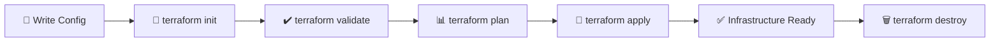

<div align="center">

# 🚀 Terraform GCP Infrastructure Guide


</div>

<style>
  .command-box {
    background: linear-gradient(135deg, #667eea 0%, #764ba2 100%);
    border-radius: 8px;
    padding: 15px;
    margin: 10px 0;
    color: white;
    font-family: 'Courier New', monospace;
  }
  
  .info-box {
    background: linear-gradient(135deg, #f093fb 0%, #f5576c 100%);
    border-radius: 8px;
    padding: 15px;
    margin: 10px 0;
    color: white;
  }
  
  .success-box {
    background: linear-gradient(135deg, #4facfe 0%, #00f2fe 100%);
    border-radius: 8px;
    padding: 15px;
    margin: 10px 0;
    color: white;
  }
  
  .warning-box {
    background: linear-gradient(135deg, #fa709a 0%, #fee140 100%);
    border-radius: 8px;
    padding: 15px;
    margin: 10px 0;
    color: #333;
  }
</style>

---

## 📋 Table of Contents

- [Prerequisites](#prerequisites)
- [Essential Terraform Commands](#essential-terraform-commands)
- [Project Structure](#project-structure)
- [Setup Instructions](#setup-instructions)
- [Access Your Instance](#access-your-instance)
- [Useful Tips](#useful-tips)

---

## ✅ Prerequisites

Before you begin, ensure you have:

- 🔧 **Terraform** installed (v1.0+)
- ☁️ **Google Cloud SDK** (gcloud CLI) installed
- 🔑 **Service Account Key** (keys.json)
- 💳 **Active GCP Project** with billing enabled

---

## 🛠️ Essential Terraform Commands

<div class="command-box">

### 🎯 Initialize Terraform
```bash
terraform init
```
Downloads provider plugins and initializes the working directory.

</div>

<div class="command-box">

### 📝 Format Terraform Files
```bash
terraform fmt
```
Automatically formats your `.tf` files to canonical style.

</div>

<div class="command-box">

### ✔️ Validate Configuration
```bash
terraform validate
```
Checks whether the configuration is syntactically valid.

</div>

<div class="command-box">

### 📊 Plan Infrastructure Changes
```bash
terraform plan
```
Shows what changes Terraform will make to your infrastructure.

</div>

<div class="command-box">

### 🚀 Apply Changes
```bash
terraform apply
```
Creates or updates infrastructure according to configuration.

**Auto-approve (skip confirmation):**
```bash
terraform apply --auto-approve
```

</div>

<div class="command-box">

### 🗑️ Destroy Infrastructure
```bash
terraform destroy
```
Removes all resources managed by Terraform.

**Auto-approve:**
```bash
terraform destroy --auto-approve
```

</div>

<div class="command-box">

### 📄 Show Current State
```bash
terraform show
```
Displays the current state or a saved plan.

</div>

<div class="command-box">

### 📋 List All Resources
```bash
terraform state list
```
Lists all resources in the Terraform state.

</div>

<div class="command-box">

### 🔍 Show Resource Details
```bash
terraform state show <resource_name>
```
Shows detailed information about a specific resource.

**Example:**
```bash
terraform state show google_compute_instance.terraform-instance
```

</div>

<div class="command-box">

### 📤 Output Values
```bash
terraform output
```
Displays all output values defined in your configuration.

**Show specific output:**
```bash
terraform output instance_internal_ip
```

</div>

<div class="command-box">

### 🔄 Refresh State
```bash
terraform refresh
```
Updates the state file with real infrastructure.

</div>

<div class="command-box">

### 📊 Generate Dependency Graph
```bash
terraform graph | dot -Tpng > graph.png
```
Creates a visual representation of resource dependencies.

</div>

---

## 📁 Project Structure

```
terraform-gcp/
├── 📄 main.tf              # Main infrastructure configuration
├── 📄 provider.tf          # Provider and authentication setup
├── 📄 output.tf            # Output definitions
├── 📄 nginx.sh             # Startup script for nginx installation
├── 🔑 keys.json            # GCP service account credentials (DO NOT COMMIT!)
└── 📖 README.md            # This file
```

---

## 🚀 Setup Instructions

<div class="info-box">

### 1️⃣ Clone and Navigate
```bash
cd c:\Users\deepakshah\Desktop\Learning\terraform\gcp
```

</div>

<div class="info-box">

### 2️⃣ Create Service Account Key
Follow the instructions in `provider.tf` to create `keys.json`

</div>

<div class="info-box">

### 3️⃣ Initialize Terraform
```bash
terraform init
```

</div>

<div class="success-box">

### 4️⃣ Deploy Infrastructure
```bash
terraform apply --auto-approve
```

</div>

---

## 🔐 Access Your Instance

<div class="warning-box">

### 🖥️ SSH into Instance
```bash
gcloud compute ssh terraform-instance --zone=us-east1-b --project=us-con-gcp-sbx-dep0019-081424
```

</div>

<div class="warning-box">

### 🌐 Access Nginx via IAP Tunnel
```bash
gcloud compute start-iap-tunnel terraform-instance 80 --local-host-port=localhost:8080 --zone=us-east1-b --project=us-con-gcp-sbx-dep0019-081424
```

Then open: **http://localhost:8080** 🎉

</div>

---

## 💡 Useful Tips

| Emoji | Tip | Command |
|-------|-----|---------|
| 🔍 | Check Terraform version | `terraform version` |
| 🧹 | Clean up cached files | Remove `.terraform/` directory |
| 📦 | Upgrade providers | `terraform init -upgrade` |
| 🔒 | Lock state for safety | Automatically done during apply |
| 📝 | View execution logs | `export TF_LOG=DEBUG` (Linux/Mac) or `$env:TF_LOG="DEBUG"` (PowerShell) |
| 🎯 | Target specific resource | `terraform apply -target=google_compute_instance.terraform-instance` |
| 💾 | Save plan to file | `terraform plan -out=tfplan` |
| 📥 | Apply saved plan | `terraform apply tfplan` |

---

## 🔥 Quick Reference Card

### Common Workflow



---

## ⚠️ Important Notes

<div class="warning-box">

- 🚫 **Never commit `keys.json`** to version control
- 💰 **Monitor GCP costs** - resources incur charges
- 🧹 **Clean up resources** when done to avoid charges
- 🔒 **Use IAM best practices** - least privilege principle
- 📋 **Review plans carefully** before applying

</div>

---

## 🎓 Additional Resources

- 📚 [Terraform Documentation](https://www.terraform.io/docs)
- ☁️ [GCP Terraform Provider](https://registry.terraform.io/providers/hashicorp/google/latest/docs)
- 🎥 [Terraform Tutorials](https://learn.hashicorp.com/terraform)
- 💬 [Terraform Community](https://discuss.hashicorp.com/c/terraform-core)

---

<div align="center">

### 🌟 Made with Terraform & GCP 🌟

**Happy Terraforming! 🚀**


</div>
